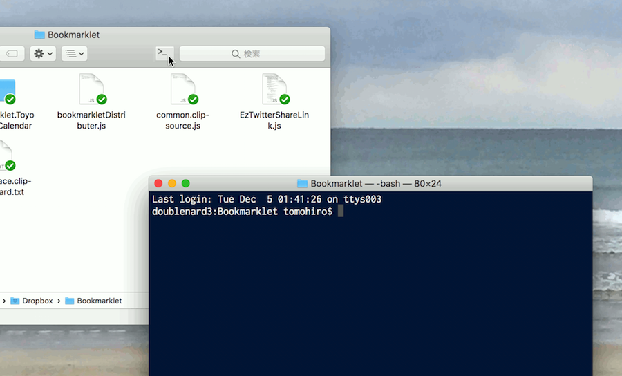

# OpenTerminal for macOS

[](https://travis-ci.org/es-kumagai/OpenTerminal)


This is a app for opening a `Terminal` window from `Finder` window.

## How to use

Just launch `OpenTerminal.app`. When do so, a new `Terminal` window will be opened and move the current directory to the app's bundle path.

### Launch from toolbar

We can also register this apps to `Finder`'s toolbar, then launch it from there. In this way, we can open a new `Terminal` window with the finder's path as current directory immediately.

When you select a folder in a `Finder` window, you can open a new `Terminal` window and move the current directory to the selected folder's path by clicking this app's icon in the toolbar on the `Finder` window. Also you are able to selecting some of folders in a `Finder`window. In this time, each paths of folder's will be opend in separated `Terminal` windows.

Alternatively, you click with no selection, a new `Terminal` window will be opened with the path shown in `Finder` as current directory.



## How to build

To build this app, open `Terminal` and clone this repository. Then move this project directory and type `xcodebuild`. By doing this, this app will be created in `build/Release` directory.

```bash
git clone https://github.com/es-kumagai/OpenTerminal.git
cd OpenTerminal

xcodebuild
```

## How to register to toolbar

First, `OpenTerminal` app move to any folder (e.g. `/Application` or `~/Application`) then the app drag with `⌘`+`⌥` keys, and drop it to toolbar in a `Finder` window.